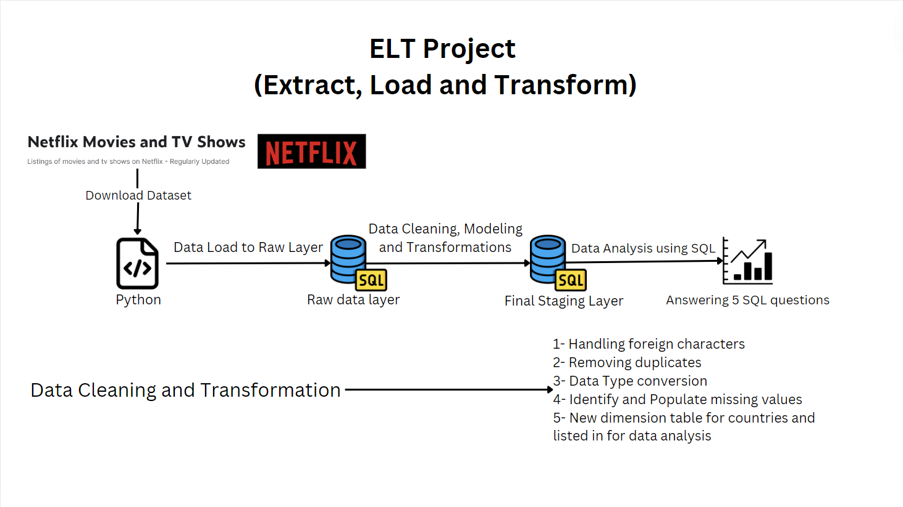

# ELT Project: Netflix-Data-Cleaning-and-Analysis
## Table of Contents

- [Introduction](#introduction)
- [Project Overview](#project-overview)
- [Dataset](#Dataset)
- [Features](#features)
- [Prerequisites](#prerequisites)
- [Installation](#installation)
- [Usage](#usage)
- [Contributing](#contributing)

## Introduction

This project demonstrates an ELT (Extract, Load, and Transform) process for cleaning and analyzing Netflix Movies and TV Shows data. The goal is to download the dataset, clean and transform the data, and perform SQL analysis to answer specific questions.

## Project Overview
  

### Steps Involved:
- **Extract**: Download the Netflix Movies and TV Shows dataset using Python.
  
- **Load**: Load the raw data into the Raw Data Layer using SQL.
  
- **Transform**: Perform data cleaning, modeling, and transformations on the raw data. Load the transformed data into the Final Staging Layer.
  
- **Analyze**: Conduct data analysis using SQL to answer 5 specific questions.
  
## Dataset

This dataset consists of listings of all the movies and tv shows available on Netflix, along with details such as - cast, directors, ratings, release year, duration, etc.

## Data Cleaning and Transformation Tasks

- **Handling Foreign Characters**: Ensure all foreign characters in the dataset are correctly encoded and standardized.

- **Removing Duplicates**: Identify and remove any duplicate entries to ensure data integrity.
  
- **Data Type Conversion**: Convert data types as necessary for accurate data analysis.
  
- **Identify and Populate Missing Values**: Detect missing values and use appropriate methods to populate them.
  
- **New Dimension Table for Countries**: Create a new dimension table for countries and list relevant data for comprehensive analysis.

## SQL Analysis

Using the transformed data in the Final Staging Layer, perform SQL queries to answer the following five questions:

- **Question 1**: For each director count the no of movies and tv shows created by them in separate columns 
for directors who have created tv shows and movies both.

- **Question 2**: Which country has highest number of comedy movies.
  
- **Question 3**: For each year (as per date added to netflix), which director has maximum number of movies released.
  
- **Question 4**: What is average duration of movies in each genre.
  
- **Question 5**: ind the list of directors who have created horror and comedy movies both.

## How to Run the Project

- **Prerequisites**:
For each director count the no of movies and tv shows created by them in separate columns 
for directors who have created tv shows and movies both.

- **Question 2**: Which country has highest number of comedy movies.
  
- **Question 3**: For each year (as per date added to netflix), which director has maximum number of movies released.
  
- **Question 4**: What is average duration of movies in each genre.
  
- **Question 5**: ind the list of directors who have created horror and comedy movies both.

## Usage

1. To use this flood detection system, follow the steps mentioned in the project documentation or Jupyter notebooks if provided.

2. Customize the model according to your specific use case and data sources.

3. Run the file on kaggle.

## Contributing

Contributions are welcome! If you would like to contribute to this project, please follow these guidelines:

1. Fork the repository.
2. Create a new branch for your feature or bug fix.
3. Make your changes and ensure they work as expected.
4. Commit your changes and create a pull request.
